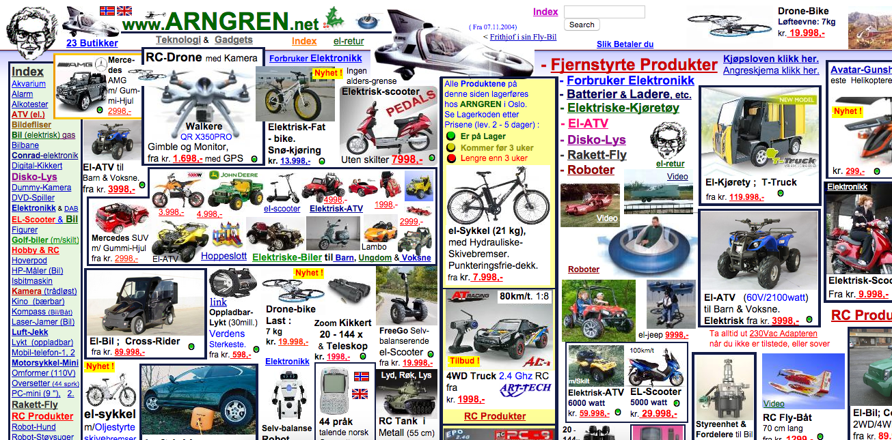
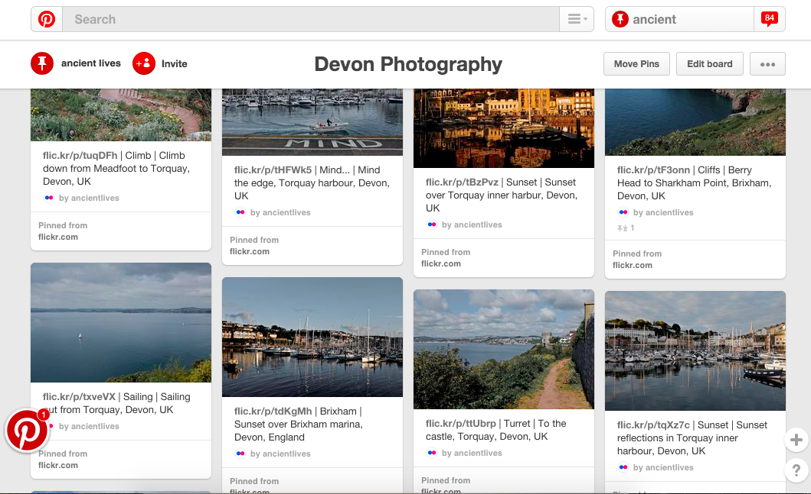
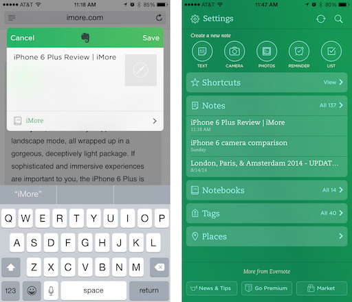
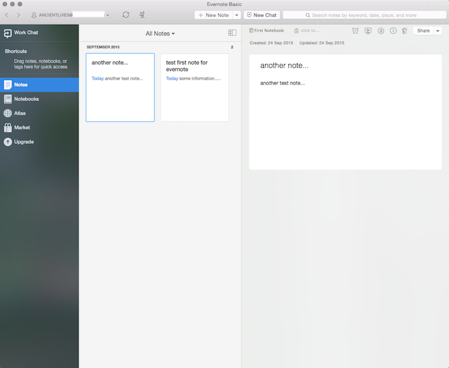
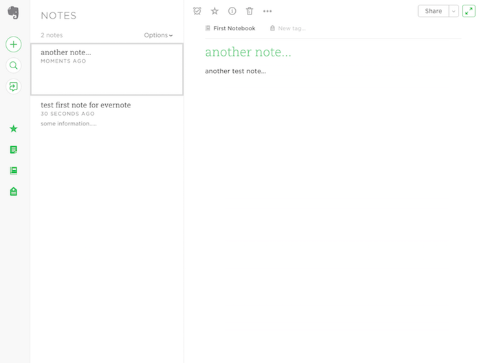

### Design - Design and interface

A brief overview of interface design for web stack and mobile applications.

#### Contents
* Intro
* Goals
* Design as a guide
* Communication
* Direction and principles
* Tools of the trade
* Common mistakes
* Consistency, consistency...
* Considering consistency, and more consistency...
* Examples of poor consistency to consider

#### Intro

As we start to build our applications, and consider broader design issues and implementation, it's important, and indeed useful, to remember the very nature of these applications.

Inherently, they are highly interactive, they display content from myriad sources, including databases and streaming APIs, they communicate with other systems, and they are now more dynamic than ever. They are often designed and implemented with more than one activity in mind, and can often represent actions such as finding results and records, whilst also managing that data.

In essence, we can see that what makes these apps interesting to design and develop, is also what makes them inherently compelling to use; quite simply, their access to and awareness of real-time data and streams. Consider many different applications, from news to banking, and we can see changes in data provision affecting the nature of our designs.

#### Goals

One of the issues with app design is often focusing on both functionality, and complementary aesthetics.

If we look at client-side design trends in general, we can see how the very ubiquity of digital applications has led to a reduction, or watered down effect, for many early design conventions. It is rare indeed to see a site still use browser defaults for links, for example. It is often an actual design or aesthetic choice, a lack of design for design's sake, to leave them set to a blue with underline.

If we consider the sheer breadth and diversity of devices and network connected applications, we can also see a dizzying number of evolving patterns and standards. Consider Apple's or Google's design guidelines, and then compare them to Microsoft's.

In essence, design for many of these applications has become a type of free-for-all, and there is no single pattern for use, no unified visual language outside of prescribed ecosystems.

Therefore, whilst we may not wish to return to the examples of blue links, we certainly want the applications we design and use to be more than simply utilitarian. I doubt it's a coincidence that Apple's recent rise has coincided with a greater awareness in design and the value of aesthetics.

#### Design as a guide

It may sound obvious, but interfaces simply allow us to mediate communication options and associated interaction through screens and available networks.

Therefore, there is a definite need for a clear visual language that contains signs and symbols to help inform our users, and provide complementary direction and feedback. It is not as simple as just presenting the data as various forms of information.

>> ...primary technique to achieve improved visual communication is to use clear, distinct, consistent visible language...
  Marcus, Aaron. *Graphic Design for Electronic Documents and User Interfaces*

So, if we consider detailed, complex visual interfaces, we can observe the many messages they often try to convey on a single screen. Inherently, the challenge for design is to create some semblance of direction, order, and pattern to help users simply make sense of what they see. In effect, to help them create a sense of order from chaos.

#### Communication

Communication, in general, can be considered as involving a sender, a message, a conveying signal or carrier for the message, and a receiver or viewer who needs to interpret the message. As we consider this simple process, we can readily observe how, as designers and developers, we are not able to control the entire process. With interface design, the very act of selecting elements with user expectations in mind, and then the combination of these elements with appropriate and useful visual signals that users actually understand, most of the time, makes it more likely that a given target audience of users will successfully understand and interpret our message.

In effect, we need interfaces that will help us successfully manage the increasingly complex nature of data, and that preserve our sense of the real and exact.

#### Direction and principles

By providing a framework, a set of basic, underlying principles that we can follow or use as an initial template, we can start designing our applications with a more informed decision-making process that helps us bridge form and function, and provide a sense of the beautiful with the useful. It's important to realise, that in app design, as with most examples of design, such considerations are not mutually exclusive.

We may consider some underlying principles, and how to apply them to our designs, which inherently help inform good practice and design choices for our development work. These principles will focus upon consistency, hierarchy, and basic design personality.

Therefore, we can often consider these underlying principles in a similar vein to syntax or language. **Consistency** and **hierarchy** are often seen as analogous to a language's grammar, which a user learns whilst using an application.

The visual characteristics, notable traits in effect, of our design become the words we use to convey our message. The functionality and purpose of our applications through the visual **personality** of our design.

Such principles can hold true even as technology continues to evolve, which inherently affects the development of our applications. Our design aesthetics and principles can remain as a footprint of our work.

#### Tools of the trade

We may also consider the visual tools of our trade, not so much applications to help us design, but the nuts and bolts of visual design. The **tools** that help us layout and construct our interfaces for users.

Therefore, we'll need to define and outline the various visual tools of application design, which include

  * affordances
  * colour
  * controls
  * imagery
  * layout
  * type

These visual tools may seem easy and straight-forward, almost commonplace, but their correct usage and implementation in app design will affect interpretation and representation of almost every aspect of our applications and, of course, their design.

#### Common mistakes

We'll also consider some of the common mistakes that affect our ability to design and implement consistency within our interfaces. We can often consider interfaces that achieve consistency as achieving the following,

  * colours appropriate for the criteria or usage environment
    * consistent use of colours
  * consistent standards for typography
  * consistent implementation and styling of controls
  * elements correctly organised and aligned
  * elements placed in a logical position for users
    * i.e. where users expect to find them
  * fonts used appropriate to a given situation, event...
  * grouping of similar, contiguous elements

#### Consistency, consistency...

Imagine if we had to learn to use an application which looked different on each page. Or, perhaps it used icons for actions in some locations, and text in other areas. In effect, an application that applies colours in a seemingly random order, and with no discernible design patterns or rules.

As designers and developers, we need to establish rules for placement and usage of interface elements. Then, importantly, we need to consistently adhere to these prescribed rules. We can mix and match visual interface characteristics without confusing, and annoying, our users.

Our designer's visual language, like natural language, requires a set of rules to be applied consistently, which can then be recognised and interpreted. Try switching in the middle of a conversation from English to French, then French to German, and then back to English via Japanese. You won't be popular in most circumstances.

Consistency in design, as with most aspects of life, is not exciting or necessarily interesting, but it will help our users gain an innate sense of familiarity with an application. This will, hopefully, drive further adoption and usage. Therefore, design consistency is simply about giving users what they can understand and, in essence, rely on throughout an application.

#### Image - design consistency example

[Source - Arngren.net](http://www.arngren.net/)

#### Considering consistency, and more consistency...

As we start to design our interfaces for applications, and then update them in response to feedback or feature changes, we'll notice how the smallest changes can cause a ripple effect throughout our application. A small change, such as repositioning a button or changing a colour, can annoy and alienate a user base or customer.

Applications may change and evolve, implementing new or updated technologies and options, but we still need to establish consistency in usage. For example, consider the interface of Pinterest. It uses an interface mechanism of almost endless scrolling to display a rich variety of images. However, this is now an accepted option for an interface pattern.

In effect, this pattern is attempting to solve a given problem. The user needs to view a subset of data that is not easily displayed on a single page. Therefore, an application's content should be presented to users as a focused subset of a much larger, seemingly endless set. An inherent component of this pattern is that a user needs to be aware of the ongoing content without excessive effort or hindrance to the usage experience.

We can use this pattern when there is more relevant data to show than our interface can comfortably accommodate. In effect, we can't fit all of it on the same page, so we allow a user to continuously scroll to retrieve more and more of the dataset. This can be better than simply navigating to another page, as it helps the user maintain an almost unbroken focus solely upon the content, and not the necessity to navigate, click, or even think about what to do next. The action of scrolling becomes a natural act of simply retrieving additional data. It is presented as an alternative to paging through a set of data, and is particularly useful for large datasets of contiguous information, which is not necessarily organised in a formal structured manner.

#### Image - Pinterest continuous scroll

[Source - Pinterest](https://www.pinterest.com/ancientlives/devon-photography/)

#### Establishing consistency

As interface designers, we can help our users by starting with elements and designs that people are familiar with from other examples and applications. In essence, users' expectations can simply be influenced by what they see onscreen, and naturally what they've seen in the past. It's one of the reasons why it's important to review and consider many different types and examples of applications, and their interface designs.

Forms can be a good example of this type of conditioning and expectation in users. If a user sees a form for payment or credit card information, they have normally seen and used other examples. These examples will often follow the same pattern. Why change if it is not broken?

Of course, we can modify slightly such form layouts to better match specific requirements, such as text, specific event or purchase details, and so on. However, a user will normally look for interface elements such as a **submit** button, and they will normally look in the same position over and over again. As users, we become conditioned to use patterns on a regular basis.

Establishing such consistency relies on an inherent awareness of user expectations. Part of this is formed by expectations we set as designers via visible conventions on an application's screen. Another part is the expectation set from other screens that might use the same patterns and elements. The other part, as mentioned already, is simply the pre-existing expectations of our users. There's not much we can do about this, except test, learn, and observe.

#### Examples of poor consistency to consider...

Evernote offers a noticeable lack of consistency with their designs for mobile, desktop, and web.

##### example 1 - Evernote app on iOS

##### example 2 - Evernote app on OS X

##### example 3 - Evernote website

