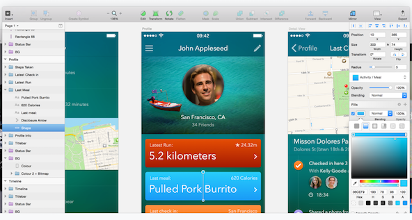
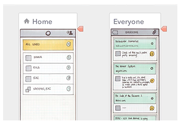

### Design - Mockups

A brief overview of options for creating mockups and prototypes.

#### Contents
  * Application appearance
  * Hi-fi mockups
  * Hi-fi prototypes
  * Low-Fi mockups and prototypes
  * Rapid prototyping
  * A few example tools for mockups and prototypes

#### Application appearance

  * prototype or mockup helps us plan and visualise an application's appearance and interface
    * could be high fidelity or low fidelity
    * choice often reflects state of the application and intended purpose of the mockup or prototype
      * eg: sales/funding demo vs design for development
    * perceptual difference between mockup and prototype
      * static mockups do not specify behaviour
        * rely upon additional interaction and behavioural specifications
      * prototype designed to demonstrate an application's intended behaviour
    * prototype perceived as an interactive piece of software in its own right
      * not considered fully functional, finished product
      * may only represent small components of the application
      * intended to show sample scenarios, interactions...

#### Hi-Fi mockups

  * intended to act as a realistic approximation of an application's design
  * allows us to represent and visualise the appearance of the user interface
    * often used for demonstration purposes, such as attracting funding, sales contracts...
  * allows us to test colour schemes, design layouts, patterns...
  * hi-fi mockups normally designed as static images with no actual interaction
  * Adobe's Photoshop, Illustrator, In-Design...often popular tools for creating such mockups
    * offer detailed, relatively quick mockups to help visualise an application
  * HTML, CSS...also popular options for creating quick, hi-fi mockups
    * can be used for a variety of application mockups

#### Image - Hi-Fi mockup

Source - Sketch (http://bohemiancoding.com/sketch/)

#### Hi-Fi prototypes

  * prototype intended to act as an interactive application
    * not intended as fully functional application
    * a concise working simulation
  * prototype intended to create a rapid, working example of functional components of an app
  * code often sufficient to simulate and replicate results for a given action and scenario
    * often will not include a database or persistent data storage
    * may simply simulate and demonstrate action of saving the data
  * important to create a prototype of the interface and user interaction
    * not backend logic and implementation
  * prototypes normally limited in their breadth and depth of functionality
    * should not be shallow in its implementation
    * demonstrate and evaluate an app's specified details in depth
    * shows careful, well-planned concept and design for each aspect of your app
  * **NB:** high fidelity prototypes can be time consuming to produce correctly

#### Hi-Fi prototype

Framer

 * many examples available at the Framer website
     * OK Google (http://framerjs.com/examples/preview/#voice-onboarding.framer)
     * Android Lollipop (http://share.framerjs.com/5fxd71on0mz8/)
     * Carousel (http://framerjs.com/examples/preview/#carousel-onboarding.framer)
         * best demo at the moment...

#### Low-Fi mockups and prototypes

  * low-fi mockups often seen as a **rough sketch** or outline
  * often referred to simply as **wireframes**
  * their simplicity can offer an inherent utility and speed of creation
  * not trying to recreate the exact look and feel of an app
  * often more interested in layout of visual components and elements
    * offers a quick reference point for further development
  * easily sketched on paper, or use formal tools such as
    * Adobe's Photoshop, Illustrator...
    * The Gimp - an interesting open source alternative
    * could even use a simple tool like Google Drawings
    * many mobile drawing apps as well
  * inherent benefit of low-fi mockups is quick creation
    * quick to modify and update
  * low-fi prototypes often seen as a series of linked low-fi mockups
    * simple interaction leads to mockup sketches
    * again, not aiming for pixel accurate representations of app

#### Image - Low-Fi mockup

Source - Flinto (https://www.flinto.com/)

#### Rapid prototyping

  * provides quick examples of an application's design
    * helps promote and encourage development and iterative design
  * iterative design helps encourage feedback early in the design process
    * continues throughout the design process as well
  * we might consider the following as we develop our prototypes
    * consider what needs to be prototyped early and often
    * how much do we actually need to prototype at each stage?
        * consider the most common design elements and interaction
        * checking how something will work and not prototyping a full application
    * work out how different places in the app are connected
        * connection between interactions, places...
        * consider the patterns that exist within the app
        * example pathways for a user through the app to achieve a given goal
    * choose your iterations for prototypes
        * helps us avoid the temptation to prototype the whole application at once
    * different fidelity for different iterative stages
        * low-fi mockups for initial design layout and elements
        * low-fi prototypes for many initial interactions
        * hi-fi prototypes as we approach the final product

#### A few example tools for mockups and prototypes

  * HTML, CSS, JavaScript, Bootstrap (http://getbootstrap.com/)...
  * Adobe Photoshop (http://goo.gl/GsIYY0), Illustrator (http://goo.gl/9K8Kfw)
  * Sketch (http://bohemiancoding.com/sketch/)
  * Proto.io (https://proto.io/)
  * Flinto (https://www.flinto.com/)
  * framer (http://framerjs.com/)
  * mirror.js (http://jimulabs.com/mirrorjs-preview/)
    * useful for Android...
  * Google Drawings (http://goo.gl/qPRCfG)
  * XCode Interface Builder (https://developer.apple.com/xcode/interface-builder/)
  * Apple's Keynote (http://keynotopia.com/guides/)
    * useful for iOS
